# netty进行服务代理

## 一、服务器配置
本次压测一共三台服务器阿里云ecs服务器，配置如下：

|  服务器 | 角色  | 配置  |
|  ----  | ----  | ----  |
| 服务器1  | nginx服务 | 8核16G |
| 服务器2  | proxy服务 | 8核16G |
| 服务器3  | wrk客户端 | 12核24G |
## 二、nginx性能测试
nginx确实牛，经过对系统及nginx的一些列优化后，单机压测QPS达到38w+。

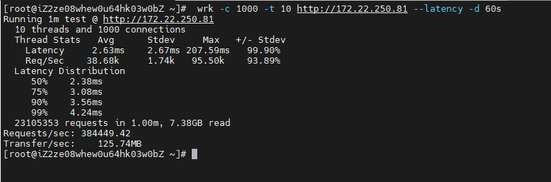
## 三、netty代理程序性能测试
基于Netty写的最简单的转发HTTP请求的程序，进行压力测试，主要分为如下差异：
### 1. 四层和七层代理
四层的代理，我们仅仅是使用Netty来转发ByteBuf，七层的代理，会进行ttp请求的编码解码以及Http请求的聚合，因此会产生更多额外的开销。

### 2. 不同线程模型（单独线程组、复用线程组、复用线程）
Netty的线程池分为boss线程池和work线程池，其中boss线程池负责接收网络请求，而work线程池负责处理io任务及其他自定义任务，对于代理应用来说，boss线程池是必须要的，因为要负责请求的接入，但是比较特殊的是 ，
对于调用方来说，它是一个服务端，对于后端服务来说它是一个客户端，所以他的线程模型应该是如下：

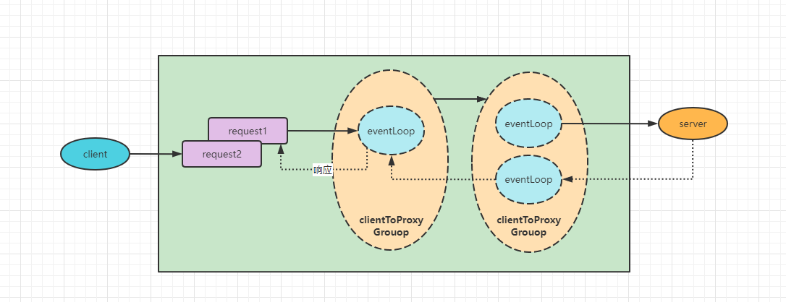
这种线程池模型是典型的netty的线程池模型，ClientToProxyGroup是负责代理服务器的处理IO请求，而ProxyServerGroup负责转发请求到后端服务，但是这种线程模型存在ClientToProxyGroup和ProxyServerGroup线程切换的问题,

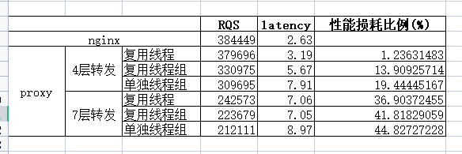
这种线程池模型是将ClientToProxyWorker和ProxyServerWorker复用同一个线程池，这种做法在省却了一个线程切换的时间，也就是对于代理服务器来说，netty的服务端及netty的客户端在线程池传入时复用同一个线程池对象；

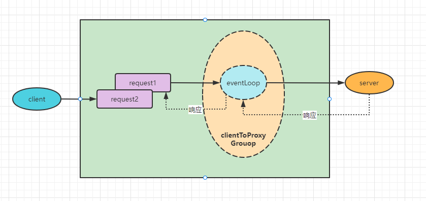

这个线程模型的话，整个处理请求及转发请求都复用同一个线程，而这种做法的话线程的切换基本没有，zuul2也是是用来这样的线程模型。

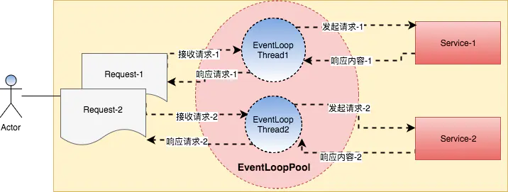

```java
/当channel激活的时候  我们创建一个Bootstrap
public void channelActive(ChannelHandlerContext ctx){
   Bootstrap bootstrap = ....
   bootstrap.channel(NioSocketChannel.class).handler(new newHandler())
   //关键代码  ctx.channel().eventloop() 共用一个eventloop
   bootstrap.group(ctx.channel().eventloop())
   bootstrap.connect()......
}
```

### 3. 四层转发
|  服务器 | 角色  | 配置  |
|  ----  | ----  | ----  |
| 服务器1  | nginx服务 | 8核16G |
| 服务器2  | proxy服务 | 8核16G |
| 服务器3  | wrk客户端 | 12核24G |

- 四层转发复用线程

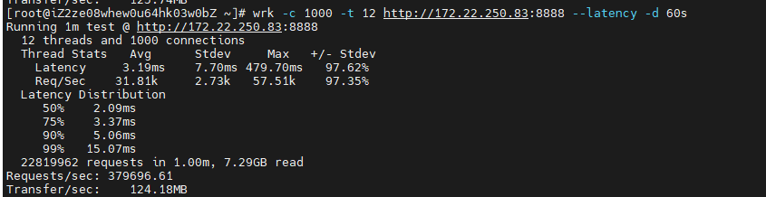
- 四层转发复用线程组
  

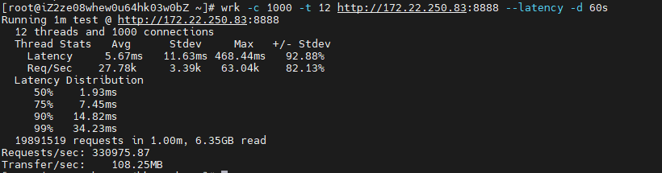
- 四层转发单独线程池
  

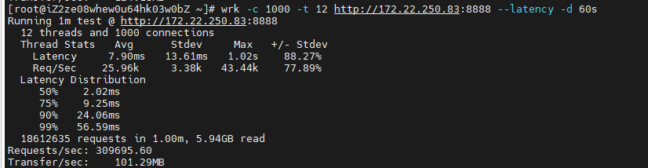
### 4. 七层转发
- 七层转发复用线程

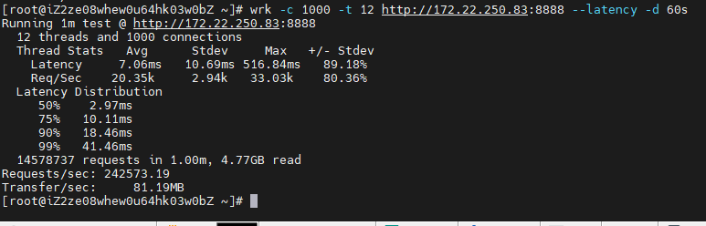
- 七层转发复用线程组

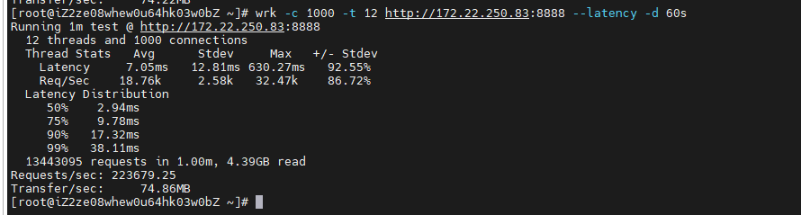
- 七层转发单独线程池

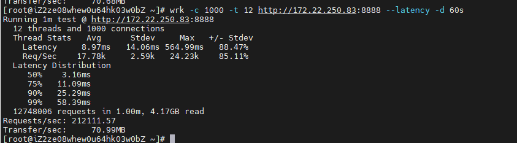
### 5. 压测结果


# 四、总结

## 1. 线程模型性能差异
由于线程切换的问题，复用线程时的性能最好，CPU占用最少，延迟最小。最差的是使用单独线程池的情况，在使用Netty开发网络代理应该复用IO线程。
通过pidstat -t -w -p pid 查看线程切换情况

- 复用线程时线程上下文切换情况
```
Linux 3.10.0-1160.66.1.el7.x86_64 (iZ2zega6mw98958icx1vobZ) 	_x86_64_	(8 CPU)
03:23:58 PM   UID      TGID       TID   cswch/s nvcswch/s  Command
03:23:58 PM     0         -      6685     21.65      0.00  |__epollEventLoopG
03:23:58 PM     0         -      6706     40.81      0.26  |__epollEventLoopG
03:23:58 PM     0         -      6707     37.71      0.36  |__epollEventLoopG
03:23:58 PM     0         -      6708     42.00      0.22  |__epollEventLoopG
03:23:58 PM     0         -      6709     34.46      0.41  |__epollEventLoopG
03:23:58 PM     0         -      6710     37.39      0.25  |__epollEventLoopG
03:23:58 PM     0         -      6711     42.77      0.26  |__epollEventLoopG
03:23:58 PM     0         -      6712     34.60      0.36  |__epollEventLoopG
03:23:58 PM     0         -      6713     39.51      0.34  |__epollEventLoopG
03:23:58 PM     0         -      6714     35.72      0.26  |__epollEventLoopG
03:23:58 PM     0         -      6715     34.47      0.32  |__epollEventLoopG
03:23:58 PM     0         -      6716     38.19      0.33  |__epollEventLoopG
03:23:58 PM     0         -      6717     37.15      0.31  |__epollEventLoopG
03:23:58 PM     0         -      6718     38.55      0.22  |__epollEventLoopG
03:23:58 PM     0         -      6719     36.32      0.39  |__epollEventLoopG
03:23:58 PM     0         -      6720     41.37      0.41  |__epollEventLoopG
03:23:58 PM     0         -      6721     37.69      0.25  |__epollEventLoopG

```
- 复用线程组时线程上下文切换情况
```
Linux 3.10.0-1160.66.1.el7.x86_64 (iZ2zega6mw98958icx1vobZ) 	 	_x86_64_	(8 CPU)

03:18:11 PM   UID      TGID       TID   cswch/s nvcswch/s  Command
03:18:11 PM     0         -      4630     16.33      0.00  |__epollEventLoopG
03:18:11 PM     0         -      4658     67.82      0.09  |__epollEventLoopG
03:18:11 PM     0         -      4659     63.06      0.13  |__epollEventLoopG
03:18:11 PM     0         -      4660     69.68      0.10  |__epollEventLoopG
03:18:11 PM     0         -      4661     66.95      0.10  |__epollEventLoopG
03:18:11 PM     0         -      4662     64.68      0.11  |__epollEventLoopG
03:18:11 PM     0         -      4663     65.35      0.10  |__epollEventLoopG
03:18:11 PM     0         -      4664     68.64      0.11  |__epollEventLoopG
03:18:11 PM     0         -      4665     65.14      0.11  |__epollEventLoopG
03:18:11 PM     0         -      4666     66.00      0.10  |__epollEventLoopG
03:18:11 PM     0         -      4667     65.85      0.10  |__epollEventLoopG
03:18:11 PM     0         -      4668     63.71      0.11  |__epollEventLoopG
03:18:11 PM     0         -      4669     65.11      0.12  |__epollEventLoopG
03:18:11 PM     0         -      4670     66.72      0.12  |__epollEventLoopG
03:18:11 PM     0         -      4671     64.17      0.09  |__epollEventLoopG
03:18:11 PM     0         -      4672     66.59      0.09  |__epollEventLoopG
03:18:11 PM     0         -      4673     64.81      0.11  |__epollEventLoopG

```
- 单独线程组时线程上下文切换情况
```
Linux 3.10.0-1160.66.1.el7.x86_64 (iZ2zega6mw98958icx1vobZ) 	 	_x86_64_	(8 CPU)

03:20:40 PM   UID      TGID       TID   cswch/s nvcswch/s  Command
03:20:40 PM     0         -      5759     13.43      0.00  |__epollEventLoopG
03:20:40 PM     0         -      5769     47.26      0.04  |__epollEventLoopG
03:20:40 PM     0         -      5770     39.77      0.31  |__epollEventLoopG
03:20:40 PM     0         -      5771     34.68      0.21  |__epollEventLoopG
03:20:40 PM     0         -      5772     41.43      0.23  |__epollEventLoopG
03:20:40 PM     0         -      5773     49.34      0.10  |__epollEventLoopG
03:20:40 PM     0         -      5774     40.69      0.36  |__epollEventLoopG
03:20:40 PM     0         -      5775     37.74      0.30  |__epollEventLoopG
03:20:40 PM     0         -      5776     29.39      0.32  |__epollEventLoopG
03:20:40 PM     0         -      5777     46.72      0.08  |__epollEventLoopG
03:20:40 PM     0         -      5778     39.36      0.26  |__epollEventLoopG
03:20:40 PM     0         -      5779     40.10      0.19  |__epollEventLoopG
03:20:40 PM     0         -      5780     41.58      0.22  |__epollEventLoopG
03:20:40 PM     0         -      5781     39.58      0.28  |__epollEventLoopG
03:20:40 PM     0         -      5782     33.81      0.73  |__epollEventLoopG
03:20:40 PM     0         -      5783     52.73      0.07  |__epollEventLoopG
03:20:40 PM     0         -      5784     57.38      0.03  |__epollEventLoopG
03:20:40 PM     0         -      5785     56.23      0.30  |__epollEventLoopG
03:20:40 PM     0         -      5786     51.34      0.11  |__epollEventLoopG
03:20:40 PM     0         -      5787     52.61      0.05  |__epollEventLoopG
03:20:40 PM     0         -      5788     46.62      0.17  |__epollEventLoopG
03:20:40 PM     0         -      5789     37.87      0.75  |__epollEventLoopG
03:20:40 PM     0         -      5790     54.12      0.02  |__epollEventLoopG
03:20:40 PM     0         -      5791     55.54      0.06  |__epollEventLoopG
03:20:40 PM     0         -      5792     59.21      0.04  |__epollEventLoopG
03:20:40 PM     0         -      5793     52.72      0.05  |__epollEventLoopG
03:20:40 PM     0         -      5794     50.37      0.03  |__epollEventLoopG
03:20:40 PM     0         -      5795     59.42      0.07  |__epollEventLoopG
03:20:40 PM     0         -      5796     55.46      0.02  |__epollEventLoopG
03:20:40 PM     0         -      5797     58.87      0.03  |__epollEventLoopG
03:20:40 PM     0         -      5798     57.11      0.12  |__epollEventLoopG
03:20:40 PM     0         -      5799     40.19      0.51  |__epollEventLoopG
03:20:40 PM     0         -      5800     47.09      0.22  |__epollEventLoopG
```
## 2. 四层与七层代理性能
由于http协议的问题，七层转发的消耗比四层大很多，因此无论是在延迟上还是QPS上，四层代理都有明显优于七层代理。
